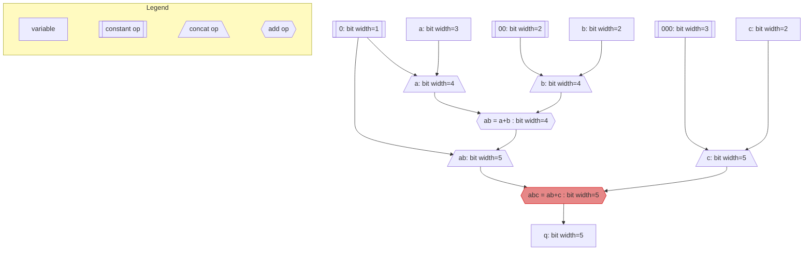

# CIRCT plugin pass example

## Preparation

### Dependencies

Build CIRCT at the same level as this example:

```sh
cd ..
git clone https://github.com/llvm/circt
cd circt
git checkout f1213ba8bdbcaba2a4903c5e078fb8c223a2ab39
git submodule update --init
cd llvm
mkdir build && cd build
cmake -G Ninja ../llvm \
    -DLLVM_ENABLE_PROJECTS="mlir" \
    -DLLVM_TARGETS_TO_BUILD="host" \
    -DLLVM_ENABLE_ASSERTIONS=ON \
    -DCMAKE_BUILD_TYPE=DEBUG \
    -DLLVM_USE_SPLIT_DWARF=ON \
    -DLLVM_ENABLE_LLD=ON
ninja
cd ../..
mkdir build && cd build
cmake -G Ninja .. \
    -DMLIR_DIR=$PWD/../llvm/build/lib/cmake/mlir \
    -DLLVM_DIR=$PWD/../llvm/build/lib/cmake/llvm \
    -DLLVM_ENABLE_ASSERTIONS=ON \
    -DCMAKE_BUILD_TYPE=DEBUG \
    -DLLVM_USE_SPLIT_DWARF=ON \
    -DLLVM_ENABLE_LLD=ON \
    -DCIRCT_SLANG_FRONTEND_ENABLED=ON
ninja
```

## Part 1: Pass plugin

### Exercise

In this part, we want to optimize `AddOp`.
This optimization targets to reduce the width of the operation.
To make this happen, we look at the inputs of the operation and check the value
ranges they have. If the output width has a size bigger than the actual value
range, we can replace this operation with a new, smaller, `AddOp`.

An example why this works:

```verilog
logic [2:0] a;        \\ Value range: 0-7
logic [1:0] b, c;     \\ Value range: 0-3
logic [3:0] ab;       \\ Value range: 0-15
logic [4:0] abc;      \\ Value range: 0-31

assign ab = a + b;    \\ ab range: 0 - 10 (7+3)
assign abc = ab + c;  \\ abc range: 0 - 13 (10+3)
```

The IR describing this behaviour can be found in [`test/basic.mlir`](test/basic.mlir).
For an overview, here is the graphical representation of the operations:



We are writing our own pass, which will optimize the size of addition operations.
The code for this is in [`CombAddOptimize.cpp`](CombAddOptimize.cpp).
The pass will need to check the range of the input signals, and if it finds an
addition which uses more bits than needed to represent the current range, it
will replace the operation with a new operation.
For this the input and output signals have to be adjusted to conform to the new
width requirements.
In the example, the operation with the red color is the one which will be
optimized.

__Pass definition__
The pass is defined in `include/CombAddOptimize/CombAddOptimize.td`.
This is a tablegen file, which is used in LLVM to serve as a code generator
framework. By defining our pass in this format, tablegen will create the
boilerplate code for us. This can be found in the directory
`build/include/CombAddOptimize/`, after the build was started.

__Plugin__
We are writing the pass in a out-of-tree fashion. This means we can run the
upstream CIRCT tool, in our case `circt-opt`, unmodified, and tell it to load
and start our pass dynamically: `-load-pass-plugin="path/to/"CombAddOptimize.so -pass-pipeline='builtin.module(reduce-comb-add-width)'`.

### Build

Build the pass as a shared library:

```sh
mkdir build && cd build
cmake -G Ninja -DCMAKE_BUILD_TYPE=Release ..
ninja
cd ..
```

### Run `circt-opt` with custom pass

```sh
../circt/build/bin/circt-opt -load-pass-plugin=build/CombAddOptimize.so -pass-pipeline='builtin.module(reduce-comb-add-width)' test/basic.mlir
```

## Part 2: Chisel generator

The previous pass only makes sense if we have a lot of additions, which we can
not all check by hand.
We are now using Chisel, a hardware construction language, to create a larger
test case for our pass.

### Chisel flow

To understand the flow, we can test this with [`example-add-gen/add-simple.scala`](example-add-gen/add-simple.scala).

```sh
cd example-add-gen
scala-cli add-simple.scala
```

This will create a file `AddSimple.mlir` with a MLIR representation of the
design.
We now need to lower this from the FIRRTL representation to the core dialects:

```sh
../../circt/build/bin/circt-opt --firrtl-lower-layers --lower-firrtl-to-hw AddSimple.mlir > AddSimple-lowered.mlir
```

And then we can use `circt-opt` again to run our custom pass:

```sh
../../circt/build/bin/circt-opt -load-pass-plugin=../build/CombAddOptimize.so -pass-pipeline='builtin.module(reduce-comb-add-width)' AddSimple-lowered.mlir > AddSimple-optimized.mlir
```

### Chisel example

We now expand the example
[`example-add-gen/uneven-addition.scala`](example-add-gen/uneven-addition.scala)
by summing up the inputs and then reduce all intermediate values until we only
have one final result.
You can be creative here and try to include as many unbalanced additions as you
want.

Adapt the flow to create the hardware design in MLIR, lower it, and then call
our custom pass. Compare the IR before our pass and after.
